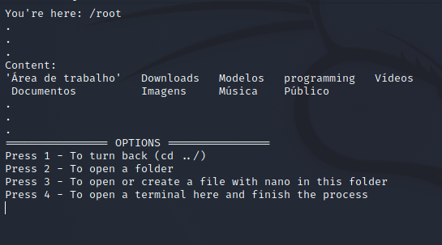

# Operable path

<a href="https://www.devmedia.com.br/introducao-ao-shell-script-no-linux/25778" target="blank"></a> <a href="https://www.kali.org/" target="blank"></a> <a href="https://www.codewars.com/users/Victor%20Hugo%20da%20Silva" target="blank"></a>

I'm currently learning shell scripting and I know how difficult it is to change directories via the terminal. So I thought about coding an automated and interactive shell script. Thus, the user only needs to enter the folder and name files to navigate between directories. To control, the code is running in a "while loop" until the user stop and the user needs to enter a number listed in the options. Choosing a number, the script will execute the code necessary for the action.

#### Project Status

**🚀 Finished **

## prerequisites

To execute this code it's necessary have a linux operating system, because the code into it was created to work with zsh. So if your OS is other, try to create a virtual machine. if your system is Linux, continue following the steps below:


When done, you will need to enable the run option for file.sh:

```bash
  chmod +r operable-paths.sh
```

If you want to change the code, it's necessary use a code editor of your preference. I recommend use [Visual Studio Code](https://code.visualstudio.com/download).

## Preview




## How to use

To run the file you only need to specify the name of the file in Terminal preceded of " ./ ". To do this you have to be in the file folder

### 🛠 Features

The following features were used to build the project:

- [Bash](https://pt.wikipedia.org/wiki/Bash)
- [Linux](https://developer.mozilla.org/pt-BR/docs/Web/CSS)

---

## 💪 How to contribute with the project

1. Make a **fork** of the project.

2. Make a new branch with your changes: `git checkout -b my-feature`

3. Save the changes and make a commit telling what you do `git commit -m "feature: My new feature"`

4. Submit your changes: `git push origin my-feature`

> In case of doubt acess this [guia de como contribuir no GitHub](./CONTRIBUTING.md)

---

### Author


<sub><b>Victor Hugo</b></sub>🚀

Created with dedication by Victor Hugo da Silva 👋🏽 contact

---

[](https://www.linkedin.com/in/victor-silva-9485021b2/)

[](mailto:victor470hugo@gmail.com)
